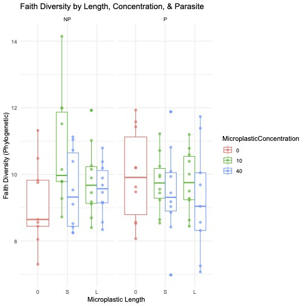
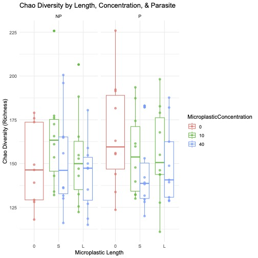
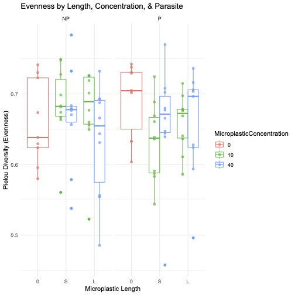
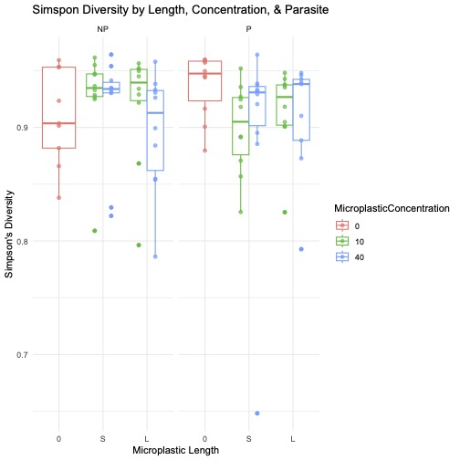

# Comparison of Alpha Diversity Metrics

This document provides a summary of the alpha diversity analyses conducted using several different metrics. While the main analysis reported in the primary `README.md` focuses on the Shannon Diversity Index, this project also explored other common alpha diversity metrics to ensure a robust assessment of the treatment effects.

The same statistical approach, the non-parametric **Scheirer-Ray-Hare test**, was used for each metric to test the effects of `CombinedTreatment` (microplastic exposure), `Parasite` status, and their interaction.

## Summary of Results by Metric

Below are the results for each alpha diversity metric tested.

### 1. Faith's Phylogenetic Diversity (Faith's PD)

This metric accounts for the phylogenetic relationships between species in the community.
*   **Analysis Script**: `rarefiedFaithPDNonParametricUnifiedPlot.R`
*   **Results**:
    *   `CombinedTreatment`: H = 4.5814, p = 0.333
    *   `Parasite`: H = 0.0086, p = 0.926
    *   `Interaction`: H = 3.5493, p = 0.470

### 2. Chao1 Index

This metric estimates species richness, giving more weight to rare species.
*   **Analysis Script**: `rarefiedChao1NonParametricUnifiedPlot.R`
*   **Results**:
    *   `CombinedTreatment`: H = 3.9024, p = 0.419
    *   `Parasite`: H = 0.1202, p = 0.729
    *   `Interaction`: H = 3.3200, p = 0.506

### 3. Pielou's Evenness Index

This metric measures the evenness of species distribution in the community.
*   **Analysis Script**: `rarefiedPielouNonParametricUnifiedPlot.R`
*   **Results**:
    *   `CombinedTreatment`: H = 1.7167, p = 0.788
    *   `Parasite`: H = 0.2413, p = 0.623
    *   `Interaction`: H = 8.0328, p = 0.090

### 4. Simpson's Index

This metric measures the probability that two individuals randomly selected from a sample will belong to the same species. It is heavily weighted towards the most abundant species.
*   **Analysis Script**: `rarefiedSimpsonNonParametricUnifiedPlot.R`
*   **Results**:
    *   `CombinedTreatment`: H = 2.9269, p = 0.570
    *   `Parasite`: H = 0.1257, p = 0.723
    *   `Interaction`: H = 7.8668, p = 0.097
    

## Overall Conclusion

Across all tested alpha diversity metrics (Shannon, Faith's PD, Chao1, Pielou's Evenness, and Simpson's Index), **no significant effects** of microplastic exposure, parasite infection, or their interaction were found on the alpha diversity of the tadpole gut microbiome. This consistency strengthens the conclusion that the treatments did not alter the within-sample microbial diversity in this experiment. 