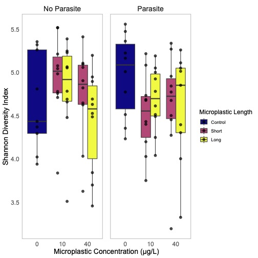

# Alpha Diversity Analysis: Tadpole Gut Microbiome

This directory contains the scripts and results for the alpha diversity analysis of the tadpole gut microbiome, investigating the effects of microplastic exposure and parasite infection on microbial community richness and evenness.

## Objective

The primary goal of this analysis was to determine if and how microbial community diversity within individual samples (alpha diversity) is affected by different treatments. Specifically, we tested the effects of:
1.  **Parasite Infection**: Presence vs. Absence.
2.  **Microplastic Exposure**: Control (no plastics) vs. different concentrations (10 µg/L, 40 µg/L) and lengths (Short, Long) of microplastics.

This was assessed using the **Shannon Diversity Index**, a metric that accounts for both the number of species (richness) and their relative abundance (evenness).

For a detailed comparison of results using other common alpha diversity metrics (including Faith's PD, Chao1, Pielou's Evenness, and Simpson's Index), please see the **[Alpha Diversity Metrics Comparison](./Alpha_Diversity_Metrics_Comparison.md)**.

## Methodology

The analysis was conducted in the `rarefiedShannonNonParametricUnifiedPlot.R` script.

1.  **Data**:
    *   **Alpha Diversity Data**: Shannon diversity values were calculated from a rarefied OTU table and loaded from `rarefied_shannon.tsv`.
    *   **Metadata**: Sample metadata included information on `Parasite` status, microplastic `Concentration`, and `MPF.length..Long.Short.`.

2.  **Analysis Steps**:
    *   A `CombinedTreatment` variable was created to represent the different microplastic exposure groups (e.g., "Treated_10_S", "Treated_40_L") and a "Control" group.
    *   **Statistical Testing**: The **Scheirer-Ray-Hare test** was performed. This is a non-parametric equivalent of a two-way ANOVA, used here to test for effects of `CombinedTreatment`, `Parasite`, and their interaction on the Shannon diversity index. This test was chosen as it is robust to data that does not meet the assumptions of parametric tests like ANOVA.

## Key Results

The results of the Scheirer-Ray-Hare test are included as comments at the end of the `rarefiedShannonNonParametricUnifiedPlot.R` script.

The test revealed **no significant effects**:
*   **Microplastic Exposure (`CombinedTreatment`)**: The different microplastic exposures did not significantly alter Shannon diversity (H = 2.6490, p = 0.618).
*   **Parasite Infection (`Parasite`)**: Parasite status had no significant effect on Shannon diversity (H = 0.3965, p = 0.529).
*   **Interaction (`CombinedTreatment:Parasite`)**: There was no significant interaction effect between microplastic exposure and parasite infection (H = 6.9526, p = 0.138).

In summary, the alpha diversity of the tadpole gut microbiome, as measured by the Shannon index, did not appear to be impacted by the experimental treatments.

## Visualization

The analysis generated a key boxplot, which is displayed below. It visualizes the distribution of the Shannon Diversity Index across the different microplastic concentrations and lengths, faceted by parasite status.

 