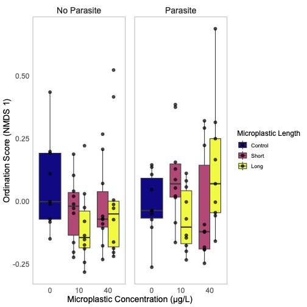
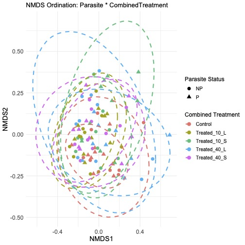
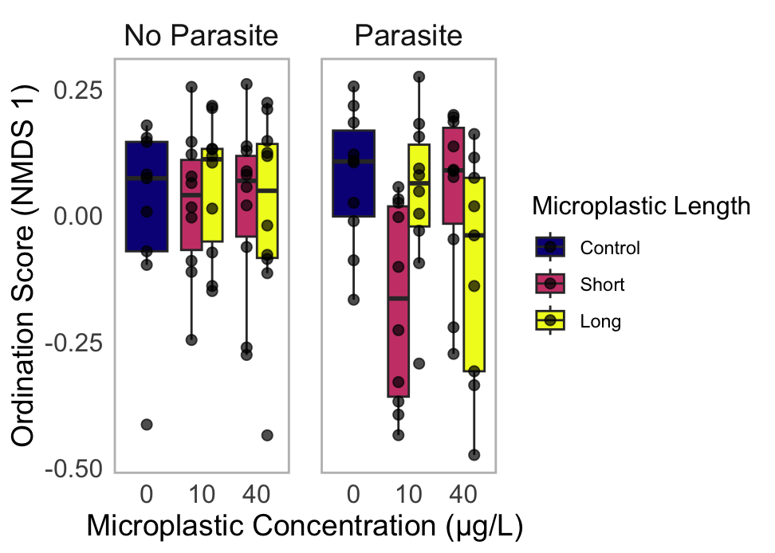
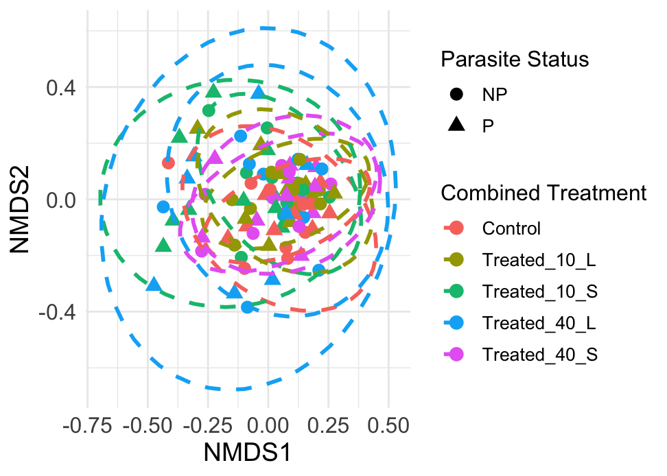

# Beta Diversity Analysis: Tadpole Gut Microbiome

This directory contains the scripts and results for the beta diversity analysis of the tadpole gut microbiome, investigating the effects of microplastic exposure and parasite infection.

## Objective

The primary goal of this analysis was to determine if and how microbial community structure (beta diversity) differs among tadpoles exposed to various treatments. Specifically, we tested the effects of:
1.  **Parasite Infection**: Presence vs. Absence.
2.  **Microplastic Exposure**: Control (no plastics) vs. different concentrations (10 µg/L, 40 µg/L) and lengths (Short, Long) of microplastics.

## Methodology

The analysis was conducted in the `rarefiedBrayCurtisUnified.R` script.

1.  **Data**:
    *   **Community Data**: A Bray-Curtis dissimilarity matrix, calculated from a rarefied OTU table, was used as the measure of beta diversity.
    *   **Metadata**: Sample metadata included information on `Parasite` status, microplastic `Concentration`, and microplastic `MPF.length..Long.Short.`.

2.  **Analysis Steps**:
    *   A new variable, `CombinedTreatment`, was created to represent the different microplastic exposure groups (e.g., "Treated_10_S", "Treated_40_L") and a "Control" group.
    *   **Ordination**: Non-metric Multidimensional Scaling (NMDS) was performed on the Bray-Curtis matrix to visualize the relationships between the microbial communities of different samples. The primary ordination axis (NMDS1) was used for visualization with boxplots.
    *   **Statistical Testing**:
        *   A **Permutational Multivariate Analysis of Variance (PERMANOVA)** was conducted using the `adonis2` function from the `vegan` package. The model tested for the effects of `Parasite`, `CombinedTreatment`, and their interaction on microbial community structure.
        *   Following the main PERMANOVA, a **pairwise PERMANOVA** was performed to identify which specific treatment groups differed from each other. P-values were adjusted using the Bonferroni method to account for multiple comparisons.

## Key Results

The results from the PERMANOVA and subsequent pairwise tests are included as comments within the `rarefiedBrayCurtisUnified.R` script.

### 1. Overall PERMANOVA

The main PERMANOVA test revealed:
*   A **significant effect of microplastic exposure** (`CombinedTreatment`) on the microbial community structure (R² = 0.074, p = 0.005).
*   No significant effect of `Parasite` status (p = 0.559).
*   No significant interaction between `Parasite` and `CombinedTreatment` (p = 0.407).

This indicates that microplastic exposure, but not parasite infection, was a significant driver of differences in the overall gut microbial community composition.

### 2. Pairwise Comparisons

The pairwise PERMANOVA showed that the significant differences were primarily between the control group and the lower concentration microplastic groups:
*   **`Control` vs. `Treated_10_S` (10 µg/L, Short)**: Significant difference (p.adj = 0.04).
*   **`Control` vs. `Treated_10_L` (10 µg/L, Long)**: Significant difference (p.adj = 0.04).

No other comparisons were significant after Bonferroni correction. This suggests that exposure to microplastics at a concentration of 10 µg/L caused a significant shift in the gut microbial community compared to unexposed controls, regardless of fiber length.

### 3. Visualization

The analysis generated two key plots, which are displayed below.

*   **Boxplot of NMDS Axis 1**: This plot shows the distribution of the primary ordination axis (NMDS1) scores across different treatment groups, faceted by parasite status. It visually summarizes the community shifts.

    

*   **NMDS Ordination Plot**: This plot shows the full NMDS ordination of all samples. Points are colored by treatment group and shaped by parasite status. The ellipses represent the 95% confidence interval for each group.

    

These plots are saved from the R script. You can find them in the `BetaAnalysis` folder.

---

## Complementary Analysis using Jaccard Distance

To ensure the results were robust, a complementary analysis was performed using the **Jaccard distance** metric (`rarefiedJaccardUnified.R`). Unlike Bray-Curtis, which is based on species abundance, Jaccard distance is based on the **presence or absence** of species. This allows us to see if community changes are due to shifts in abundance or the complete appearance/disappearance of certain taxa.

### 1. Overall PERMANOVA (Jaccard)

The Jaccard-based PERMANOVA revealed:
*   A **highly significant effect of microplastic exposure** (`CombinedTreatment`), consistent with the Bray-Curtis results (R² = 0.061, p = 0.001).
*   No significant main effect of `Parasite` status (p = 0.435).
*   A **borderline significant interaction** between `Parasite` and `CombinedTreatment` (R² = 0.048, p = 0.066), suggesting the effect of microplastics on species presence/absence may differ slightly depending on parasite status.

### 2. Pairwise Comparisons (Jaccard)

The pairwise analysis showed one significant difference after Bonferroni correction:
*   **`Control` vs. `Treated_10_S` (10 µg/L, Short)**: Significant difference (p.adj = 0.04).

This finding reinforces that the 10 µg/L short-fiber treatment caused a significant shift in the microbial community, specifically relating to which species were present or absent compared to the control group.

### 3. Visualization (Jaccard)

The plots below visualize the Jaccard-based NMDS ordination.

*   **Boxplot of NMDS Axis 1 (Jaccard)**:

    

*   **NMDS Ordination Plot (Jaccard)**:

     