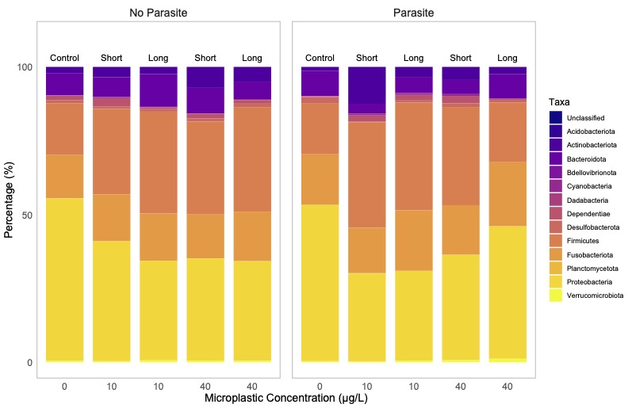

# Taxonomic Composition Analysis

This directory contains the scripts and results for the taxonomic composition analysis of the tadpole gut microbiome. This analysis visualizes how the relative abundance of different bacterial phyla changes in response to microplastic exposure and parasite infection.

## Objective

The goal of this analysis was to create a stacked bar plot illustrating the taxonomic breakdown of the microbial community at the phylum level for each experimental treatment group. This allows for a visual comparison of how community structure shifts across treatments.

## Methodology

The analysis and plot generation were conducted in the `taxaBarPlotFinal.R` script.

1.  **Data**:
    *   **Community Data**: Taxonomic counts at Level 2 (Phylum) were loaded from the `level-2-rarefied.csv` file.
    *   **Metadata**: The same file contained sample metadata, including `Parasite` status, microplastic `Concentration`, and `MPF_length`.

2.  **Analysis Steps**:
    *   **Data Aggregation**: The script groups all samples by their unique treatment combination (`Parasite`, `Concentration`, `MPF_length`). Within each group, the total counts for each bacterial phylum are summed.
    *   **Percentage Calculation**: The absolute counts for each phylum are converted into percentages relative to the total counts within each treatment group.
    *   **Plot Generation**: A stacked bar plot is created using `ggplot2`. Each bar represents a unique combination of microplastic concentration and length, and the plot is faceted to separate parasite-exposed and non-exposed groups.

## Visualization

The final output is a stacked bar plot showing the relative abundance of bacterial phyla for each treatment group.

*   The **x-axis** is organized by microplastic concentration.
*   Labels of "Control", "Short", or "Long" appear above each bar to indicate the microplastic fiber length.
*   The **y-axis** represents the percentage of the community.
*   Each **colored segment** corresponds to a different bacterial phylum.
*   The plot is split into two panels: "No Parasite" and "Parasite".

 